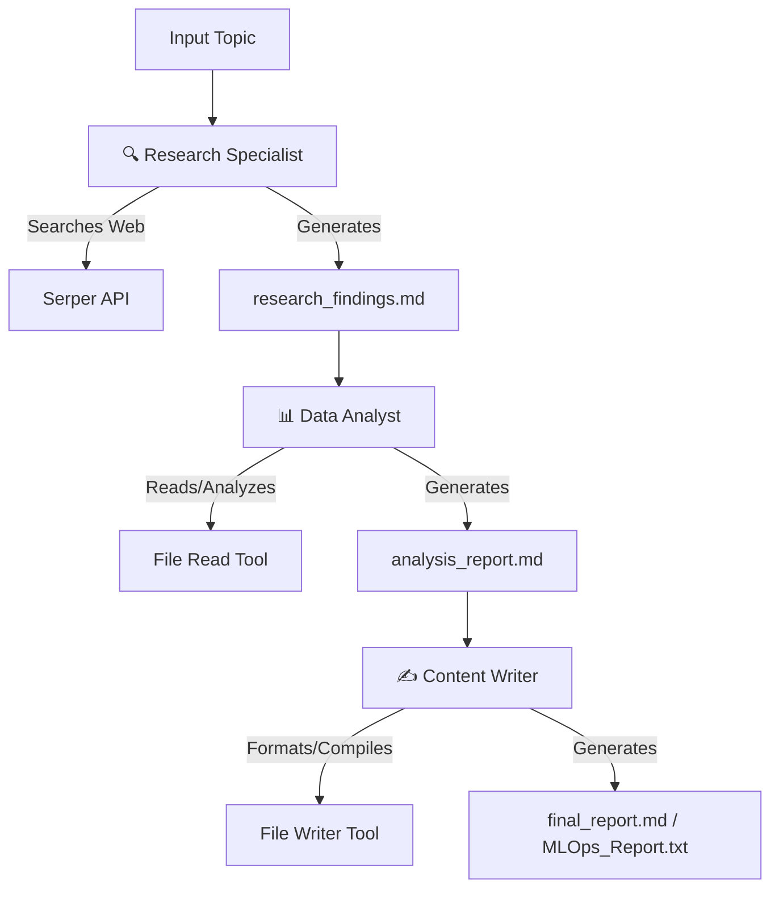

# 🔬 Multi-Agent AI Research Assistant

An intelligent, automated research assistant built with **CrewAI**, **Streamlit**, and **Groq** (using the high-performance `llama-3.3-70b-versatile` model). This system deploys a collaborative crew of specialized AI agents to research, analyze, and write comprehensive reports on any topic.

---

## 🤖 How It Works (Multi-Agent Architecture)

The assistant uses three specialized AI agents, each with dedicated roles, goals, backstories, and tools:



1. **🔍 Research Specialist**: Gathers information from multiple web sources using search tools to compile raw research findings.
2. **📊 Data Analyst**: Reads the findings, extracts key insights, identifies patterns/trends, and structures them into an analysis report.
3. **✍️ Content Writer**: Takes the analysis and formats it into a highly professional, well-structured final markdown report.

---

## 🚀 Features

* **Streamlit Web UI**: Simple and modern interface to start research tasks, monitor real-time agent workflow status, and download reports.
* **Groq Acceleration**: Leverages Groq's high-speed API with the `llama-3.3-70b-versatile` model for lightning-fast reasoning.
* **Document Downloads**: Instantly download compiled `Research Findings`, `Analysis Reports`, and `Final Reports` as Markdown files directly from the UI.
* **Cross-Platform Compatibility**: Reconfigured to bypass common Python 3.13/3.14 native compile limitations.

---

## 🛠️ Local Setup Instructions

### Prerequisites
Make sure you have **Python 3.11** or **Python 3.13** installed.

### 1. Clone the Repository
```bash
git clone https://github.com/Omkar4140/research-agents-crewai.git
cd research-agents-crewai
```

### 2. Set Up a Virtual Environment
```bash
python -m venv .venv
```
Activate the environment:
* **Windows (PowerShell):** `.\.venv\Scripts\Activate.ps1`
* **macOS/Linux:** `source .venv/bin/activate`

### 3. Install Dependencies
To ensure you do not run into compilation issues with C/Rust extensions on Windows/macOS, install utilizing pre-built wheels:
```bash
pip install --upgrade pip
pip install -r requirements.txt
pip install litellm --only-binary :all:
```

### 4. Configure Environment Variables
Create a `.env` file in the root directory:
```env
# API Keys
GROQ_API_KEY=your_groq_api_key_here
SERPER_API_KEY=your_serper_api_key_here

# LLM Configs
RESEARCH_AGENT_LLM=groq/llama-3.3-70b-versatile
ANALYST_AGENT_LLM=groq/llama-3.3-70b-versatile
WRITER_AGENT_LLM=groq/llama-3.3-70b-versatile
QA_AGENT_LLM=groq/llama-3.3-70b-versatile

# Temperature Configurations
RESEARCH_AGENT_TEMPERATURE=0.1
ANALYST_AGENT_TEMPERATURE=0.2
WRITER_AGENT_TEMPERATURE=0.3
QA_AGENT_TEMPERATURE=0.4
```

### 5. Run the Application
* **Streamlit Web GUI:**
  ```bash
  streamlit run app.py
  ```
* **Command Line Version:**
  ```bash
  python main.py
  ```

---

## ☁️ Deployment on Streamlit Community Cloud

You can deploy this application for free on [Streamlit Community Cloud](https://share.streamlit.io/):

1. **Fork/Push this repository** to your GitHub account.
2. Visit [Streamlit Community Cloud](https://share.streamlit.io/) and log in with your GitHub account.
3. Click **"New App"** and select this repository, branch (`main` or `master`), and specify `app.py` as the entry file.
4. **Important (Secrets Configuration):**
   * Before deploying, click on **"Advanced Settings"** in the Streamlit deploy modal.
   * Under the **Secrets** section, paste the environment variables from your `.env` file:
     ```toml
     GROQ_API_KEY = "your-actual-groq-key"
     SERPER_API_KEY = "your-actual-serper-key"
     RESEARCH_AGENT_LLM = "groq/llama-3.3-70b-versatile"
     ANALYST_AGENT_LLM = "groq/llama-3.3-70b-versatile"
     WRITER_AGENT_LLM = "groq/llama-3.3-70b-versatile"
     QA_AGENT_LLM = "groq/llama-3.3-70b-versatile"
     RESEARCH_AGENT_TEMPERATURE = "0.1"
     ANALYST_AGENT_TEMPERATURE = "0.2"
     WRITER_AGENT_TEMPERATURE = "0.3"
     QA_AGENT_TEMPERATURE = "0.4"
     ```
5. Click **"Deploy"** and wait for Streamlit to install the requirements and spin up the server container!